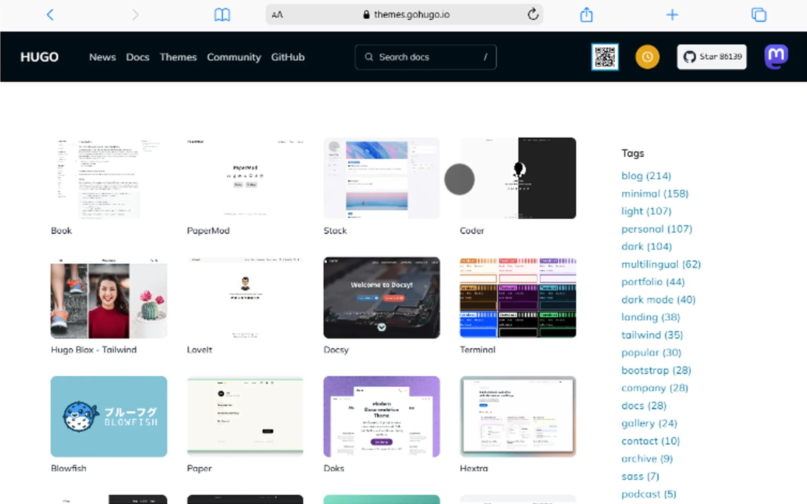

No desenvolvimento web moderno, **performance, simplicidade e custo** importam cada vez mais. É nesse cenário que os **Geradores de Sites Estáticos (SSG)** se destacam — e o **Hugo** é um dos mais rápidos e eficientes entre eles.

Neste tutorial, você vai aprender **passo a passo** como começar com o Hugo, desde a instalação até a publicação do seu site.

.

---

## O que é o Hugo?

O **Hugo** é um gerador de sites estáticos escrito em **Go (Golang)**. Ele transforma arquivos Markdown em páginas HTML prontas para produção, usando templates, layouts e temas.

Em vez de gerar páginas sob demanda, o Hugo **pré-renderiza tudo** no momento do build, garantindo sites extremamente rápidos.

---

## Por que escolher o Hugo?

Alguns motivos que fazem o Hugo ser uma excelente escolha:

- ⚡ **Velocidade absurda:** builds em milissegundos, mesmo com centenas de páginas  
- 🔐 **Mais segurança:** sem banco de dados ou plugins rodando no servidor  
- 💸 **Hospedagem barata ou gratuita:** GitHub Pages, Netlify, Vercel  
- 🎨 **Total controle:** HTML, CSS e JS sob medida  
- 🧠 **Ótimo para devs:** estrutura clara e previsível


---

## Pré-requisitos

Antes de começar, você precisa:

- Conhecimentos básicos de **terminal**
- Noções de **Markdown**
- Git (opcional, mas recomendado)

---

## Passo 1: Instalando o Hugo

A instalação varia conforme o sistema operacional.

### Windows (via Chocolatey)

Abra o terminal como **Administrador** e execute:

```bash
choco install hugo-extended
````

### macOS (via Homebrew)

```bash
brew install hugo
```

### Linux (Ubuntu/Debian)

```bash
sudo apt install hugo
```

Para verificar se deu tudo certo:

```bash
hugo version
```


---

## Passo 2: Criando um novo site

Com o Hugo instalado, crie um novo projeto:

```bash
hugo new site meu-site-hugo
```

Entre na pasta criada:

```bash
cd meu-site-hugo
```

A estrutura inicial será parecida com esta:

```text
meu-site-hugo/
├── archetypes/
├── content/
├── layouts/
├── static/
├── themes/
└── hugo.toml
```

---

## Passo 3: Instalando um tema

O Hugo não vem com visual por padrão. Para facilitar, vamos usar um tema pronto.

Acesse: [https://themes.gohugo.io](https://themes.gohugo.io)
Escolha um tema e copie o repositório.

Exemplo usando Git:

```bash
git init
git submodule add https://github.com/theNewDynamic/gohugo-theme-ananke themes/ananke
```

Depois, edite o arquivo `hugo.toml`:

```toml
theme = "ananke"
```


---

## Passo 4: Criando conteúdo

Agora vamos criar nossa primeira página:

```bash
hugo new posts/meu-primeiro-post.md
```

Abra o arquivo criado em `content/posts/` e edite:

```markdown
---
title: "Meu Primeiro Post"
date: 2024-01-20
---

Olá! Este é meu primeiro site criado com Hugo 🚀
```

---

## Passo 5: Rodando o servidor local

Para ver o site no navegador:

```bash
hugo server
```

Acesse:
👉 `http://localhost:1313`

O site atualiza automaticamente sempre que você salva um arquivo.

> **Indicação de imagem:**
> *Screenshot do navegador exibindo o site rodando localmente com o tema aplicado.*

---

## Passo 6: Gerando o site para produção

Quando tudo estiver pronto, gere os arquivos finais:

```bash
hugo
```

O Hugo criará uma pasta chamada `public/` com todo o HTML, CSS e JS.

Essa pasta é tudo o que você precisa para publicar o site.

> **Indicação de imagem:**
> *Imagem mostrando a pasta `public/` cheia de arquivos HTML.*

---

## Passo 7: Publicando o site

Você pode hospedar seu site Hugo em:

* **GitHub Pages**
* **Netlify**
* **Vercel**

Essas plataformas funcionam perfeitamente com sites estáticos e oferecem deploy contínuo via Git.

> **Indicação de imagem:**
> *Logos do GitHub Pages, Netlify e Vercel lado a lado.*

---

## Conclusão

O Hugo é uma ferramenta poderosa para quem busca:

* Performance extrema
* Simplicidade
* Controle total do código
* Baixo custo de hospedagem

Se você é desenvolvedor front-end ou está construindo um portfólio, blog ou documentação, o Hugo é uma excelente escolha.

No próximo passo, você pode:

* Criar layouts personalizados
* Trabalhar com shortcodes
* Integrar com CMS headless
* Automatizar deploys

🚀 **Agora é com você: crie, experimente e publique!**
